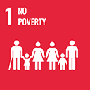
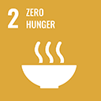
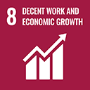
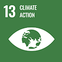
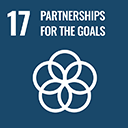

---
icon: angle-right
cover: ../../../.gitbook/assets/Image Terreni.jpg
coverY: 0
---

# Monaco Piezzo Seminativo - TCR063

* **Project Status:** Verified & Validated
* **Project Type:** CO2 Sequestration/Removal
* **Sector:** Afforestation & Reforestation (ARR)&#x20;
* **Methodology:** AgriCarbon Practice & ISO 14064-2
* **VVB ( Validation & Verification Body ):**[ Climate Standard](../../vvbs/climate-standard.md)
* **Validation Criteria:** ISO 14064-2; UNI CEI EN ISO/IEC 17029:2020; good agro-forestry practices; standard LIFE C-Farms; Verra VM0042 v2.0, CDM'’s;  AR-AMS0007 v3.1; IPCC Guidelines (2006); AgriCarbon Practice & ISO 14064-2; PDD ( Project Design Document )
* **Verification Criteria:** ISO 14064-2; UNI CEI EN ISO/IEC 17029:2020; good agro-forestry practices; standard LIFE C-Farms; Verra VM0042 v2.0, CDM'’s;  AR-AMS0007 v3.1; IPCC Guidelines (2006); AgriCarbon Practice & ISO 14064-2; Project Annual Report

