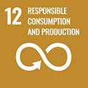

# SDG 12: Responsible Consumption and Production

**Target 12.6:** Encourage companies to adopt sustainable practices and to integrate sustainability information into their reporting cycle.

\
**Impact measurement:** Monitor the number of partner companies offsetting emissions through Carborea's carbon credits and their improvements in sustainability reporting.


