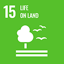

# SDG 15: Life on Land

**Target 15.1:** Ensure the conservation, restoration and sustainable use of terrestrial and inland freshwater ecosystems.

\
**Impact measurement:** Measure the increase in reforested area, biodiversity recovery and soil restoration using satellite imagery and ecological surveys.


