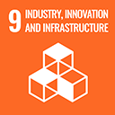

# SDG 9: Industry, Innovation and Infrastructure

**Target 9.5:** Enhance scientific research, upgrade the technological capabilities and encourage innovation.

\
**Impact measurement:** Adopt blockchain technology for carbon credit tracking, use of satellite imagery, IoT (Internet of Things) devices and other remote sensing devices for monitoring the atmosphere, trees and soil, use of assessment tools and AI-based risk prediction, prevention and mitigation criteria.


